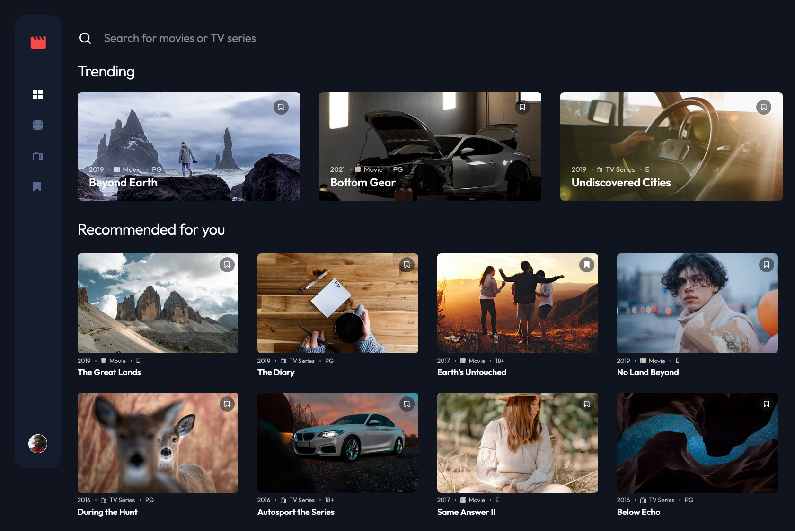

# Entertainment web app solution

This is a solution to the [Entertainment web app challenge on Frontend Mentor](https://www.frontendmentor.io/challenges/entertainment-web-app-J-UhgAW1X).

| [Solution on Frontend Mentor](https://www.frontendmentor.io/solutions/entertainment-web-app-eeRlZ_nT75) | [Project Demo on GitHub Pages](https://ionstici.dev/entertainment-web-app-fem/) |
| :-----------------------------------------------------------------------------------------------------: | :-----------------------------------------------------------------------------: |

This project is a responsive web application for browsing and bookmarking movies and TV series. It features a modern UI with animations and popups, built using a variety of libraries and tools. Users can log in and log out, add or remove bookmarks, and search dynamically for titles. The project uses a fake authentication system that operates solely on the frontend.



## Technologies Used

- **React:** JavaScript library for building user interfaces.
- **Lodash:** Utility library for JavaScript.
- **React-Hook-Form:** Library for managing forms in React.
- **React-Hot-Toast:** Library for showing toast notifications.
- **React-Router-Dom:** Library for routing in React.
- **Vite:** Build tool for modern web projects.
- **Sass:** CSS preprocessor.

## Features

- **Responsive Design:** The application is fully responsive and works on various screen sizes.
- **Animations and Popups:** Smooth animations and popup dialogs enhance user interaction.
- **Fake Authentication:** Users can log in and log out, but authentication is simulated on the frontend.
- **Toast Notifications:** Feedback messages are provided using toast notifications for various user actions.
- **Bookmark Management:** Users can add movies and TV series to bookmarks and remove them as needed.
- **Dynamic Search:** Real-time search functionality for finding movies and TV series by title.
- **Layout Spinner:** A loading spinner is displayed until all images are fully loaded.

## Project Structure

The project contains several main pages:

- **Home:** The landing page showcasing trending and recommended content.
- **Movies:** A page dedicated to browsing movies.
- **TV Series:** A page dedicated to browsing TV series.
- **Bookmarks:** A page where users can view their bookmarked content.
- **Login:** A page for user login.
- **Signup:** A page for user registration.

## Installation

To get started with the project, follow these steps:

```bash
# 1. Clone the project
git clone https://github.com/ionStici/entertainment-web-app-fem.git

# 2. Navigate to the project directory
cd entertainment-web-app-fem

# 3. Install dependencies
npm install

# 4. Start the development server
npm run dev
```

## Usage

- **Navigation Pages:** Use the sidebar to navigate between Home, Movies, TV Series, Bookmarks, Login and Signup pages.
- **Authentication:** Go to the Login or Signup pages, enter credentials (or leave the defaults), and click the action button to simulate a login or to register a new user.
- **Bookmarking Content:** Browse movies and TV series, click the bookmark icon to add or remove bookmarks.
- **Searching:** Use the search bar to find movies or TV series by title.
- **Logging Out:** Click the logout button to simulate logging out.
- **Delete User** You can delete your account data by clicking the "Delete User" button.

## Additional Information

- **Toasts:** Notifications appear at the top of the screen for actions like logging in, logging out, adding bookmarks, etc.
- **Spinners:** A spinner is shown on the layout while images are being loaded to enhance user experience.

## Contributing

Contributions are welcome! If you have any ideas, suggestions, or issues, please feel free to create a pull request or open an issue.

## License

This project is licensed under the MIT License. See [LICENSE](./LICENSE) file for more information.

## Conclusion

This project demonstrates a modern, responsive frontend application with comprehensive functionality for browsing and managing movies and TV series. It leverages popular libraries and tools to deliver a smooth user experience.

Feel free to explore the code and extend the functionality as needed. Happy coding!

## Contact

- [ionStici | GitHub](https://github.com/ionStici)
- [Ion Stici | LinkedIn](https://www.linkedin.com/in/ionstici/)

Feel free to reach out if you have any questions or suggestions!
